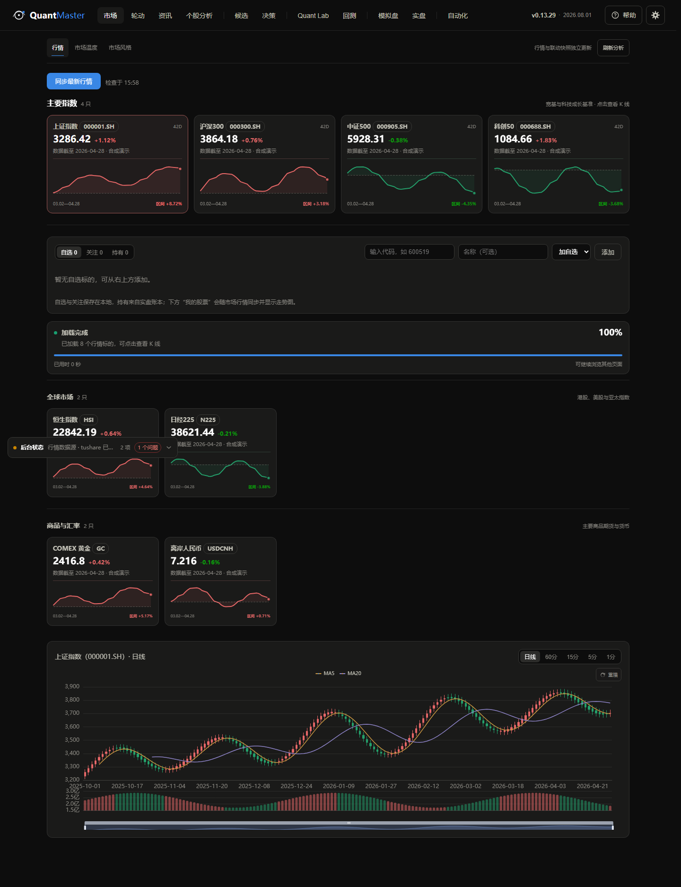
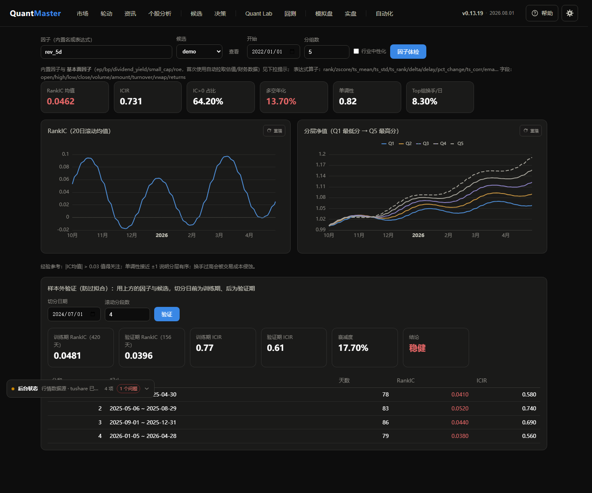
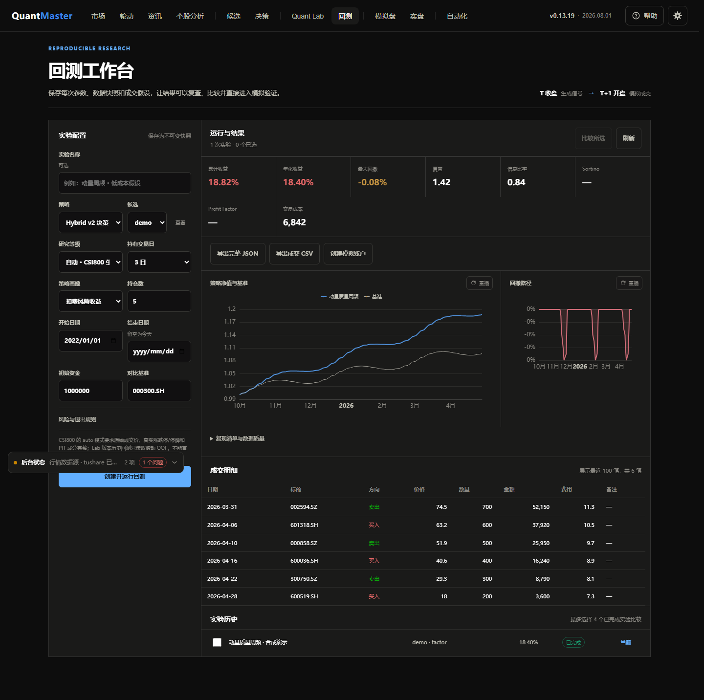
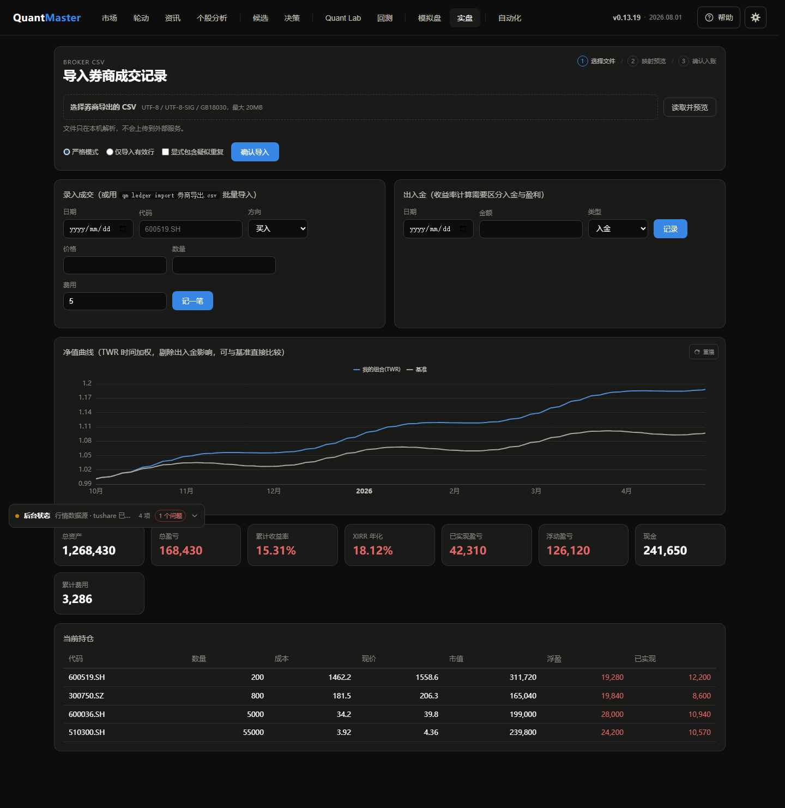

<div align="center">

# 📈 QuantMaster

**面向中国 A 股的开源量化研究与决策记录平台**

[](https://github.com/ZacharyHu0/QuantMaster/actions/workflows/ci.yml)
[](https://github.com/ZacharyHu0/QuantMaster/actions/workflows/release.yml)
[](https://github.com/ZacharyHu0/QuantMaster/actions/workflows/codeql.yml)
[](LICENSE)
[](https://www.python.org/)
[](https://github.com/ZacharyHu0/QuantMaster/releases)
[](https://github.com/ZacharyHu0/QuantMaster/stargazers)
[](https://github.com/ZacharyHu0/QuantMaster/network/members)
[](https://github.com/ZacharyHu0/QuantMaster/issues)
[](https://github.com/ZacharyHu0/QuantMaster/commits/main)

为已开户的个人投资者设计：假定你有不错的编程能力（计算机本科水平），
数学与金融只需本科基础——文档与代码注释会把用到的量化概念讲清楚。

</div>

> ⚠️ QuantMaster 1.x 是首个稳定的探索版契约，**不是生产级交易系统，也不构成投资建议**。
> 项目优先快速验证研究想法；用户仍需自行核验数据、模型与交易规则。

---

## 📑 目录

- [✨ 功能特性](#-功能特性)
- [📸 界面预览](#-界面预览)
- [🚀 快速开始](#-快速开始)
- [⚙️ 配置](#️-配置)
- [🎯 Hybrid v2 决策与 Champion](#-hybrid-v2-决策与-champion)
- [🏷️ 证券代码与名称解析](#️-证券代码与名称解析)
- [🔑 部署需要哪些 Key](#-部署需要哪些-key)
- [💬 飞书 Bot 与微信 ClawBot](#-飞书-bot-主与微信-clawbot轻量补充)
- [📰 资讯研究工作台](#-资讯研究工作台)
- [🧪 开发测试](#-开发测试)
- [📦 版本提交与 GitHub 自动同步](#-版本提交与-github-自动同步)
- [🧭 设计原则](#-设计原则)
- [📁 项目结构](#-项目结构)
- [🛠️ 技术栈](#️-技术栈)
- [🗺️ 路线图](#️-路线图)
- [📖 文档](#-文档)
- [🤝 贡献](#-贡献)
- [👥 贡献者](#-贡献者)
- [🙏 致谢](#-致谢)
- [⭐ Star History](#-star-history)
- [📄 License](#-license)
- [⚠️ 免责声明](#️-免责声明)

---

## ✨ 功能特性

| 模块 | 说明 |
| --- | --- |
| 📡 多市场数据 | 约 3.4 万条内地/香港/美国证券主数据随包离线可用，支持代码、名称和拼音智能解析；日线及 1/5/15/30/60 分钟线按频率本地 Parquet 归档，断网复用、自动降级 |
| 🏭 研究生产线 | A 股、ETF 与期货的按日 Parquet 研究湖，不可变因子/标签/风险/模型 Artifact，依赖 dry-run、增量修订、血缘、持久化续跑和可选 Rust 加速 |
| 🧭 市场状态 | 候选与行业板块的牛熊分、市场宽度、MACD、资金量和日线 RSI(14) 曲线，叠加 CNN Fear & Greed 当日仪表盘与历史背景；分当前、历史和未来 1/3/5/7 日概率展望 |
| 🔄 板块联动 | 1/3/5/20 日行业与题材变化、全量阶段分布、真实成分共振、申万 2021 行业周期和 ETF 多窗口资金；所有视图披露快照、口径、覆盖质量和降级来源，不输出买卖结论 |
| 🔎 六维个股分析 | 快速研究在 2–5 分钟内完成联网六维复核；默认深度研究最多约 15 分钟，增加三轮追证、逐维反方审查和独立证伪终审；Web 与飞书只显示可读结论和引用，并明确披露研究完整度与降级缺口 |
| 🎯 Hybrid v2 决策 | 自适应规则 + Quant Lab 因子 / ML Champion；提供三种策略画像、扣费后预期、概率校准、模型贡献、连续仓位和异常回退，面向 1 / 3 / 5 / 7 个交易日 |
| 🧪 AI Quant Lab | 48 个策展因子起点、不可变版本账本、PIT 中证800快照、purged walk-forward、FDR、交易成本与 Monte Carlo / 参数敏感性 / 穿透性门禁；学习模型先影子运行，统一验证和人工批准后才能按候选 / 周期 / 画像设为 Champion |
| ⛏️ 因子挖掘 | 遗传规划与 LLM 安全 DSL 保持可用；可选 Python AutoMiner 让模型提出受限 pandas/numpy 代码，由本地 TRAIN/VALID、参数平台、WFA、穿透测试、Pareto 和密封 TEST 筛选；代码工件、审计和人工批准全程可追溯 |
| 🧬 多因子合成 | 因子相关性矩阵、IC/ICIR 动态加权合成（防未来函数）、截面正交化、贪心去冗余 |
| 📰 资讯研究 | 内置快讯/官方来源与 RSS、JSON、HTML 声明式来源；事件按申万一级行业标注，聚合大盘情绪与板块独立分数，并形成可回测的质量加权消息面因子 |
| 🤖 AI 能力 | 统一 LLM 客户端，兼容 **Anthropic / OpenAI / 任何 OpenAI 协议网关**（DeepSeek、通义、Kimi、GLM、本地 Ollama）；资讯标注失败会退避重试，不阻塞原文入库 |
| 📈 回测 Lab | 向量化回测引擎，内置 A 股规则：**T+1、涨跌停、佣金/印花税/过户费、100 股整手、止损/止盈**；净值/回撤/年度/月度收益等完整报告；对比基准指数 |
| 💰 真实账户账本 | 自选、重点关注与真实账户持有统一工作台；账本支持券商 CSV 导入、FIFO 成本、TWR / XIRR 与基准对比 |
| 🔔 Bot 自动化 | 以飞书企业自建应用 Bot 为主通道（群聊/私聊命令、结构化告警卡片、个股分析进度卡），腾讯微信 ClawBot iLink 为轻量文本提醒；定时扫描变盘/重要消息/收盘任务，按会话选择推送强度 |
| 🖥️ 本地 Web 界面 | FastAPI + ECharts 决策工作台；「今日 → 候选」集中查看与编辑研究范围，行情卡片逐标的呈现，决策按牛熊/板块/候选分阶段可用，不必等待整次任务结束 |
| 📖 内置帮助 | 页头“帮助”提供按六部、两级目录组织的 21 章量化研究教材，从市场与数据递进到数学、定价、信号、组合和生产研究；覆盖测度变换、SDF/GMM、高级蒙特卡洛、波动率曲面、HJM、稳健优化、尾部风险与严格机器学习验证，并配有稳定深链、全文搜索、11 个可运行示例、42 道自测和 10 个本地实验工具 |

## 📸 界面预览

<p align="center">
  
  
</p>
<p align="center">
  
  
</p>

> 截图为合成数据渲染的界面演示；`qm serve` 拉取真实行情后即为实盘数据。

## 🚀 快速开始

### 环境要求

| 要求 | 说明 |
| --- | --- |
| Python | 3.12+ |
| 操作系统 | Windows / macOS / Linux |
| 可选 | Rust 工具链（原生研究内核加速）、Tushare Token（2000 积分） |

### 安装与启动

```bash
# 环境要求 Python 3.12+
pip install -e ".[data,dev]"     # data = akshare + yfinance（推荐）
# 已配置 2000 积分 Tushare token 时：pip install -e ".[data,tushare,dev]"
# 启用 Ridge 与全部深度模型：pip install -e ".[data,ml,dev]"

qm serve                          # 启动 Web 界面 -> http://127.0.0.1:8686
```

Windows 仓库用户也可以运行 `scripts\\dev\\serve.cmd --open`。脚本会固定使用项目 `.venv`，并默认
启动手动重载监督进程；源码变化不会自动替换 Web worker，FreeStockDB 在整个启动器退出前保持运行；
HTML、CSS 和 JavaScript 改动直接刷新页面即可看到。需要传统单进程模式时
运行 `scripts\\dev\\serve.cmd --no-reload`。脚本会在 `.venv/Scripts` 自动准备带项目图标和版本信息的
`QuantMaster.exe`；脚本启动后会立即退出短暂的 `cmd.exe` 启动器，因此 QuantMaster 是
可见的进程树根。任务管理器会分别显示 `QuantMaster Web Worker.exe`、
`QuantMaster Runtime Worker.exe` 与 `QuantMaster Compute Worker.exe`，便于识别热更新、
持久调度和隔离计算；托管的 `stockdb.exe` 仍由 Runtime Worker 负责启停，并和
QuantMaster 处于同一 Windows Job Object 生命周期边界内。
需要应用后端修改时，可打开页头版本号弹窗并点击“立即热更新”；该按钮是唯一的 Web
worker 重载入口，只安全替换 Web worker，不会启停 FreeStockDB。

启动后点击页头的“帮助”，可在应用内阅读完整手册；也可以直接打开
`http://127.0.0.1:8686/#help/start`。手册中的市场规则标有核验日期，实盘前仍应以
交易所与开户券商的最新文件为准。搜索结果可以直达稳定小节地址，例如
`#help/inference/help-inference-fdr`；所有计算、实验和自测均只在浏览器中运行。

### 日志与诊断

终端默认只显示启动状态、可操作警告和异常的关键业务栈；同类后台错误在 10 分钟内
只保留简短摘要。每次完整 traceback 都会写入当前数据目录下的
`logs/quantmaster.log`，日志按 10 MB 轮转并最多保留约 50 MB。需要逐次展开完整终端
traceback 时，可把 `--verbose` 放在任意命令位置，或设置 `QM_LOG_LEVEL=DEBUG`；命令
参数优先于环境变量。日志固定写入 stderr，JSON 和表格等命令结果继续独占 stdout。

### 命令行研究流程

```bash
qm fetch --universe demo --start 2022-01-01          # 拉取内置示例候选行情
qm fetch --universe demo --frequency 5m --start 2026-07-01  # 分钟线归档
qm regime --universe demo --start 2022-01-01         # 牛熊/趋势/板块/未来展望
qm select --universe demo --horizon 3 --profile risk_adjusted --top 10 # Hybrid v2 今日决策
qm decisions --universe demo --limit 20              # 回看当时实际生成的决策
qm after-close scan                                  # 全 A 股盘后板块优先级与研究候选
qm after-close show                                  # 查看最新正式快照及数据新鲜度
qm after-close history --limit 20                    # 重放历史冻结快照
qm after-close export --format csv --output scan.csv # 导出可核查候选证据
qm factor-test "rank(-delta(close, 5))"              # 因子体检：IC/分层/换手
qm backtest --factor mom_20d --top 5                 # 因子选股回测
qm backtest --strategy decision --profile stable --holding-days 3 --top 5 # 固化 Champion 回测
qm daily --strategy decision --holding-days 3         # 更新→Hybrid 快照→模拟调仓
qm crawl                                             # 抓取财经快讯 + LLM 情绪标注
qm ledger import my_trades.csv                       # 导入实盘成交记录
qm ledger report                                     # 实盘收益报告
qm automation doctor                                # 检查 Bot、任务、依赖与绑定状态
qm lab doctor                                       # Quant Lab 能力、预算与队列状态
qm lab benchmark --universe csi800 --start 2015-01-01 # 零联网冷读 / 缓存性能基准
qm lab discover --method genetic --universe demo    # 提交可恢复的因子发现任务
qm lab discover --method python --rounds 3 --candidates 24 --finalists 3 --universe csi800
qm lab train --model ridge --universe demo           # Ridge 基线；ml 依赖支持五种深度模型
qm lab optimize --universe csi800 --budget-hours 10 # 共享 1/3/5/7 日 Pareto 滚动优化
qm lab studies                                      # 查看 Study、Pareto 与密封评估状态
qm lab worker                                       # 独立研究 Worker（Web 进程外运行）
qm data capabilities                               # 检查日线权限与 Rust/Python 内核
qm data plan --assets stock,etf --specs cross_momentum_20d,forward_returns --start 2022-01-01
qm data sync --assets stock --specs cross_asset_core,forward_returns,qm_style_v1 --start 2022-01-01
qm doctor --deep                                    # 深查存储完整性、运行边界和 API/架构约束
```

`qm backtest` 与 Web 回测任务共用同一个可审计执行入口，PIT 候选、行情质量门禁、
策略快照、撮合与结果清单口径一致。CLI 仍是同步命令，不创建后台任务；Web 仍保留
持久化进度、取消和恢复。只有带完整正式证据且 `formal_eligible=true` 的新结果可创建
模拟账户；Sandbox、Quant Lab OOF 和旧的未分类结果仍可查看、比较和导出，但不能晋升。

`qm data plan` 只生成依赖、预热/前瞻窗口、分区数、预估行数和权限阻塞，
不访问生产数据。确认后再执行 `sync`；设置中心的“研究生产湖”提供相同的
dry-run、启动、取消和续跑能力。详细数据口径、ArtifactRef 和 Rust 构建见
[docs/research_pipeline.md](docs/research_pipeline.md)。

盘后扫描只在 free-stockdb 最新交易日、证券/OHLCV 覆盖和多层板块目录通过
完整性门后发布新快照；失败会继续展示上一份正式结果及过期原因。默认排除 ST、
上市不足 60 个交易日和近 20 日日均成交额低于 3,000 万元的证券，北交所默认纳入
并单独披露。候选是可审计的研究证据，不会自动下单或转化为确定性买卖建议。
一次通过验收的本地更新会冻结未复权行情、复权因子、证券/退市目录和当日板块目录，
生成可内容寻址的 `ingest_id`；盘后、ETF 研究、诊断与研究湖共用该摄取，不重复全库读取。
若配置的 Tushare 账号具备 `index_weight` 权限，系统会拉取沪深300与中证500月度点时
成分，按生效日写入研究湖 `csi800_membership` 分区；盘后验证、Quant Lab 和历史回放
复用该缓存。缺少 Token 或权限时只降级中证800基线，不影响盘后正式快照发布。

长期运行时，启用 `free_stockdb_auto_update` 会在设定时间自动安全停止受托管的
stockdb、运行可见的原生更新器并恢复服务。更新器退出后还会按全市场实际交易日、
证券覆盖和 OHLCV 完整率验收；未就绪时最多重试 3 次，每次间隔 15 分钟，单次更新器
最长运行 30 分钟。只有验收通过才登记成功并自动提交盘后扫描。热重载 worker 通过
本地 SQLite 控制邮箱把更新交给持有 stockdb 的监督进程；异常关闭遗留的进程仅在
PID、创建时间、可执行文件路径和失效 owner 均核验一致时才会被下次启动回收。

### Python API

Python API 同样直接：

```python
from quantmaster.data import load_panel
from quantmaster.factors import ExpressionFactor, analyze_factor, compute_factor

panel = load_panel(["600519.SH", "000858.SZ", "300750.SZ"], "2022-01-01", "2024-12-31")
factor = ExpressionFactor("rank(-delta(close, 5))")
report = analyze_factor(compute_factor(factor, panel), panel["close"], name="5日反转")
print(report.summary())
```

<details>
<summary>📖 更多 Python API 示例</summary>

```python
from quantmaster.data import resolve_instrument, resolve_instruments, search_instruments

matches = search_instruments("腾讯")
one = resolve_instrument("NASDAQ:AAPL")
batch = resolve_instruments(["600519", "700"], selections={"700": "00700.HK"})
```

</details>

## ⚙️ 配置

桌面端推荐启动 `qm serve` 后从「今日 → 候选」管理研究范围，从「设置」校验全部字段、读取模型列表、
检测数据源、管理资讯处理、自动化、Quant Lab 及配置快照。普通字段在停止输入或
离开字段后自动保存并热应用，不需要再点保存按钮；只有服务 host/port 需要重启。API Key 与 Token 优先进入系统凭据库，页面、
API 响应和快照都不会回显密钥。也可以复制 `config.example.yaml` 为 `config.yaml`
或使用环境变量：

```yaml
llm:
  provider: anthropic          # anthropic | openai | openai-compatible
  model: claude-sonnet-5
  api_key: ""                  # 或环境变量 ANTHROPIC_API_KEY / OPENAI_API_KEY
  base_url: ""                 # openai-compatible 时填网关地址，如 https://api.deepseek.com/v1
  reasoning_effort: medium      # 或环境变量 QM_LLM_REASONING_EFFORT
data:
  primary_provider: free-stockdb # free-stockdb | akshare | tushare
  free_stockdb_sdk_path: ""  # 用户安装的 free-stockdb/pybao 目录
  free_stockdb_url: http://127.0.0.1:7899
  free_stockdb_root: runtime/free-stockdb # 可选：用户自行解压的完整发行包目录
  free_stockdb_managed: true       # 随 QuantMaster 启停本机 stockdb
  free_stockdb_auto_update: true   # 自动停库、更新、真实交易日验收并恢复服务
  free_stockdb_update_time: "18:30"
  tushare_token: ""            # 可选
  akshare_retries: 3           # 失败后指数退避重试，再降级 Tushare
  provider_timeout: 45         # 单次数据源任务含排队的硬截止秒数
  tushare_calls_per_minute: 120 # 2000 积分档保守限速
  tushare_cache_days: 1        # 当期响应缓存；已结束历史区间长期缓存
```

旧的手工配置继续使用“环境变量覆盖 YAML”。首次从 GUI 保存后会写入
`managed_by_gui`，此后环境变量只提供缺省值，GUI/YAML 是最终值；在 GUI 中清除
凭据会记录显式禁用状态，不会被遗留环境变量意外恢复。

### Hybrid v2 决策与 Champion

「决策」默认使用扣费风险收益画像，也可切换短期命中收益或稳定可解释。规则基线始终
参与评分；Quant Lab 只有存在已批准且与候选、持有期和画像匹配的部署时，才会叠加
表达式因子或学习模型。页面的“模型依据与不可变快照”可核对实际生效版本、权重、
样本外校准和回退原因，单只候选还能展开规则 / 因子 / ML 贡献。

学习模型训练完成后先作为影子候选，不会自动影响每日决策。进入 Quant Lab 因子库，
检查统一验证证据并人工批准后，选择生效周期、画像及“仅当前候选 / 全部 A 股候选”，
再设为 Champion。回测任务和模拟账户会在创建时固化当时的策略快照；模拟账户产生调仓
或成交历史前可直接编辑策略，产生历史后则需复制为独立账户再调整，切换 Champion 也不会
改写旧结果。账户删除采用可恢复归档并保留账本。模拟盘只生成提案并按 T+1 开盘规则撮合，
不连接真实券商。

「滚动优化」使用锁定的 756 / 20 / 252 协议：开发期每 20 个交易日滚动重训，最长标签前
留 7 日 purge，最后 252 个交易日直到模型、参数和 Pareto 推荐冻结后才开启。共享模型同时
输出 1 / 3 / 5 / 7 日收益、概率和预测区间；概率校准只读取开发期 OOF。Production 还要求
PIT 中证800成分、官方交易日历、真实公告日基本面和未复权成交约束完整，否则任务明确失败，
不会降级成看似成功的近似回测。中断后的 Optuna Trial 和已完成密封块可直接恢复。

Python AutoMiner 默认关闭，需先在「设置 → Quant Lab」显式启用。模型只会收到版本化
特征目录、经济假设和本地汇总指标，不会收到原始行情；候选代码禁止导入、I/O、网络、
反射和循环，并在独立子进程中执行。TRAIN 用于参数搜索，VALID 用于 Pareto 入围，
TEST 在入围顺序冻结后才读取一次且不回流选参。非 PIT 特征可以研究，但会形成不可覆盖的
生产审批硬门槛。

日常启动优先显示本地行情：已完整覆盖的历史区间不会因 TTL 过期反复联网，近期行情
只请求缺失边界和 5 个交易日的校准窗口。动态前复权发生变化时会用重叠窗口统一价格
基准，成交量与成交额不缩放。需要重建历史库时，在「设置 → 数据与缓存」预览并确认
手动增量同步；已缓存标的只拉取尾部 5 个交易日的重叠区间，未缓存标的才按所选起点初始化，任务可取消、续跑和重试失败项。

数据源默认顺序是 **free-stockdb → AKShare → Tushare → 本地缓存**，也可在设置中
把 AKShare 或 Tushare 设为主源。QuantMaster 复用用户自行安装的
[free-stockdb](https://github.com/hello245m/free-stockdb) `StockDBClient` 与本地数据。
free-stockdb 本身是 Tushare 数据的第三方本地打包/分发路径，因此跨路径差异用于检查
打包时效、单位和字段语义，不被表述为独立上游交叉验证。QuantMaster 冻结未复权日线
与复权因子，提供 1/5/15/30/60 分钟线、申万行业、概念板块和全场 ETF 分类研究。完整发行包可自行解压到
`runtime/free-stockdb` 或在设置中选择其他目录，由 QuantMaster 可选托管启停和盘后更新；
项目不会下载或复制其程序、数据包和上游同步源。东方财富、新浪、中证、Yahoo 与 Tushare 分通道调度，
不同上游可并行，同一真实上游保持保守并发；
代理、限流或连续失败会持久化熔断并汇总日志，避免重启后再次制造错误风暴。全球参考
市场使用一次 Yahoo 批量请求。行业抓取仍按成功板块分别保存，单个板块失败不会清空其他结果。
Tushare 使用仓库 2000 积分说明中可用的前复权日线、指数、每日指标、财务指标
和申万行业接口；原始响应按接口与参数写入 `data/api_cache/tushare/`，研究和
回测重复请求相同区间不会再次占用接口次数。

### 证券代码与名称解析

证券名称、市场、交易所、品种和历史别名保存在本地 `security_master.sqlite`。首次使用从
随包压缩快照导入，不依赖东方财富等实时快照接口；Tushare 和 Nasdaq Trader 目录此后
独立增量刷新，上游暂时不可用不会删除旧记录。候选页可直接输入：

- 内地：`600519`、`sh600519`、`600519.ss`、`SSE:600519`、`贵州茅台`、`GZMT`
- 香港：`700.hk`、`HK:700`、`00700`、`腾讯控股`、`Tencent`
- 美国：`AAPL`、`NASDAQ:AAPL`、`AAPL.US`、`Apple`、`BRK.B.US`

内部统一代码示例为 `600519.SH`、`589160.SH`、`931743.CSI`、`00700.HK` 和
`AAPL.US`。没有市场限定的短代码可能跨市场重名，例如 `700`，此时界面必须选择具体
标的；使用历史只调整候选顺序，不会替用户跳过确认。Python 也可直接调用：

```python
from quantmaster.data import resolve_instrument, resolve_instruments, search_instruments

matches = search_instruments("腾讯")
one = resolve_instrument("NASDAQ:AAPL")
batch = resolve_instruments(["600519", "700"], selections={"700": "00700.HK"})
```

### 部署需要哪些 Key

- 核心行情、回测、牛熊判断、自选和账本不强制需要 Key；AKShare / yfinance 可直接使用。
- 建议再配置 `TUSHARE_TOKEN`：作为 A 股日线、指数、基本面和申万行业的稳定备用源。
- LLM 因子挖掘和资讯标注才需要 LLM API Key；如果这部分已配置好，无需增加其他 AI Key。

因此你当前只需补一个可选但推荐的 `TUSHARE_TOKEN`；没有它平台仍能运行，只是
AKShare 连续失败时只能回退本地缓存。自选、关注、持仓和所有缓存都存于 `data/`，
部署时应给该目录挂载持久卷。

### 飞书 Bot（主）与微信 ClawBot（轻量补充）

在「设置 → 自动化」接入 Bot 并开启自动化；调度器和消息通道会立即热应用，不需要重启。
「运行 → 任务与消息」负责会话绑定、推送内容、推送强度和任务操作：

1. 飞书创建企业自建应用并启用机器人能力、订阅“接收消息”事件，选择长连接方式；在
   「设置 → 自动化」填入 App ID / App Secret。Secret 只进入系统凭据库。接入后可运行
   五阶段诊断，分别查看凭据、自动化运行时、长连接、消息事件和会话绑定。
2. 飞书管理员私聊先生成绑定码并发送 `绑定 QuantMaster XXXXXXXX`，再由管理员到目标群完成群绑定。
   卡片标题固定说明推送类别，正文再展示完整事项。资讯正文包含摘要、利好 / 利空 / 中性判断、
   情绪值、重要度、来源、影响范围、相关标的、核查依据和原文链接；任务异常正文说明阶段、影响与重试动作。
   若需群聊上下文能力，还要开通敏感权限 `im:message.group_msg` 并发布新版本；机器人会静默记录
   普通群消息，只在被真实 `@QuantMaster` 时结合相关话题回答，长记录会压缩成话题记忆。
3. 每个目标可独立订阅重要资讯、盘中变盘、收盘状态、任务结果和任务失败，也可全部取消，
   此时调度任务和 Bot 命令监听仍会运行。推送强度可选择“保守 / 均衡 / 敏感”，高级设置还能
   调整阈值、确认根数、冷却时间和每小时上限；在 Bot 对话里发送“把当前推送强度调成敏感”
   也能修改当前会话。
4. 如需微信补充提醒，再选择“扫码授权”；授权后先给 ClawBot 发一条消息，系统会保存
   该会话最新的 `context_token`。受 iLink 能力限制，微信只发送文本，不承载飞书消息卡片等增强能力。

Bot 命令还支持查看任务/持仓/新闻/告警，暂停或恢复扫描，以及管理员私聊中的成交和现金流
二次确认。定时任务与长连接由 `qm serve` 进程承载，服务停止时不会继续推送。

### 资讯研究工作台

「今日 → 资讯」集中展示事件流、标注状态、大盘情绪、申万一级板块分数、相关标的和来源健康度。
每条已处理事件会显示直接受影响的板块；有明确个股代码时，还会用本地行业映射补全板块。手动处理
待标注内容时会显示真实批次、完成比例和已用时间；每批结果落库后立即刷新对应事件、统计与
因子，不必等整轮任务结束。
「设置 → 资讯来源」可启停内置来源，或添加 RSS、JSON 路径和 HTML CSS 选择器来源；
自定义来源不执行 Python 或页面脚本，也不允许访问本机/私有网络。Bearer Token 与自定义
Header 凭据只进入系统凭据库，跨域跳转和跨域详情页不会携带这些凭据。

自动化运行时固定按三组调度：快讯 10 分钟、官方 15 分钟、定期来源 60 分钟。频率、
暂停和手动运行统一在「运行 → 任务与消息」页面管理。资讯扫描只在发现实际内容时推送摘要，不再额外
发送泛化的任务完成通知；来源拉取或新闻分析失败会合并为脱敏的任务错误通知，并按小时去重。
结构化资讯长期保留；原始响应默认缓存 7 天并
在每日清理任务中回收。大盘与板块分数使用情绪、置信度、重要度、来源权重和 3 日半衰期
统一计算，范围为 -100 到 +100。`news_sentiment` 因子只读取本地资讯库，处理完成后按资讯发布时间对齐交易日，
15:00 后获取的消息进入下一交易日，默认使用 3 个自然日半衰期。

### 开发测试

每个 feature、bug 或独立重构都使用一个 `codex/<task-slug>` 分支和独立 worktree：

```bash
./.venv/Scripts/python.exe scripts/dev/tasks.py start <task-slug>
cd .worktrees/<task-slug>
../../.venv/Scripts/python.exe scripts/dev/tasks.py check
```

任务分支可自由做小步 checkpoint 提交，但不得修改 `quantmaster/release.py` 或
`CHANGELOG.md`。`check` 根据相对 `origin/main` 的改动读取受版本控制的影响映射，只运行
相邻合同；显式测试总是带 `--full`，因此不会误跳过 full-only 文件。未知路径、测试基础设施、
依赖或 CI/release 改动会保守升级到完整 Python 套件。可用 `--staged` 只检查暂存区，失败后
优先用精确 node id 或 `pytest --last-failed` 重跑。

CI 采用分层门禁：Draft PR 每次推送只运行 `fast-gate`（Ruff、异常/复杂度策略、mypy、核心
契约测试）和跨平台 `core`；标记 Ready 后才运行覆盖分片、native parity、browser 和 Windows
打包等完整矩阵。开发期不要为了“再确认一次”反复跑全套。

准备合入时先提交全部改动、只对齐一次当前 `origin/main`，然后复用同一 commit 的绿色 CI：

```bash
../../.venv/Scripts/python.exe scripts/dev/tasks.py ready --accept-ci
```

没有 GitHub/CI 访问时运行 `tasks.py ready` 本地全套；涉及浏览器、Rust 或打包时分别加
`--ui`、`--rust`、`--package`。通过后将单个任务 squash 为 `main` 上一个独立提交，并立即
执行 `scripts/dev/tasks.py remove <task-slug>` 清理。`.artifacts`、pytest basetemp、可写数据库
和运行时目录由 `tasks.py` 自动保持 worktree 独占，不要手工创建或删除。

GitHub Issue/PR/Project 状态用 `python scripts/dev/github_sync.py reconcile` 对账（默认
dry-run，确认后加 `--apply` 执行脚本列出的安全修复），不要逐项手工 `gh` 操作。

`python -m pytest` 仍可运行默认快速契约；`python -m pytest --full` 运行完整 Python 合同。
Chromium 管理流程由 CI 的独立 browser lane 验证，不要求每次本地改动重复启动浏览器。

本地复现 Draft 快检：

```bash
python scripts/ci/run.py --fast
```

`--full` 运行完整 Python 测试分片；`--all` 再加入 Chromium、Rust、wheel 和 PyInstaller
检查；`--ui`、`--rust`、`--package` 可单独追加，资源有限时可加 `--serial`。
完整分片使用本地历史耗时和 `least_duration` 均衡；当最慢分片超过最快分片 1.25 倍时，运行
`python scripts/ci/run.py --refresh-durations` 串行刷新 `.artifacts/pytest/durations.json`，目标将
三个分片耗时差控制在约 20% 内。
脚本始终使用仓库 `.venv` 解释器，即使 Git hook 由系统 Python 启动也不会混用环境。
Windows 上会自动发现已安装的 Windows SDK 库目录，避免 Git hook 缺少开发者命令行环境时 Rust 链接失败。

在 `main` 上提交版本时，已安装的 `.githooks/pre-commit` 会自动执行
`python scripts/ci/run.py --fast`；完整的 `--all` 验收在发布前单独运行。门禁失败会阻止提交，因而不会触发 post-commit 的远端自动推送。

## 📦 版本提交与 GitHub 自动同步

克隆仓库后执行一次：

```bash
python scripts/release/sync.py install
```

此后任务分支提交不需要版本变更，且 hook 会拒绝任务分支修改发布元数据。普通任务 squash
到 `main` 也不会产生版本或 Release。版本变更只在 owner 明确要求时，由单独的版本 PR 一次
完成：同时递增 `quantmaster/release.py`、更新实际发布日期并在 `CHANGELOG.md` 顶部加入
对应说明。post-commit 会自动重试推送该 main release；普通任务分支和 Claude 归档分支不会
自动上传。
安装命令会为 HTTPS origin 自动绑定仓库 owner，并按完整仓库路径隔离 GitHub 凭据，
避免系统凭据管理器误用另一个 GitHub 账号；不会把 Token 或密码写入仓库。弱网下单次
`git push` 默认 180 秒超时，可在安装时用 `--push-timeout 30..600` 调整，失败后仍保留恢复标记。

如果网络或授权导致 push 失败，提交仍安全保留，并在 `.git` 内标记为待同步；下一次
发布会被 pre-commit 阻止，直到运行以下命令完成同步：

```bash
python scripts/release/sync.py status
python scripts/release/sync.py push
```

`pre-commit` 只允许待提交版本使用上海当日作为实际发布日期；`status` 与 `push` 对历史
提交只校验内部一致且日期不在未来，因此跨日恢复不会被误阻止。开始下一版本前还必须存在
精确指向上一提交的不可变 `v{VERSION}` tag。若已推送版本的 CI 明确失败且尚未打 tag，维护者
可用 `python scripts/release/sync.py recover-ci --run-id <RUN_ID>` 将失败 run、当前提交和版本绑定
在 `.git` 内；该授权只允许前向发布紧邻的 patch 版本，并会在新版本成功推送后自动清除。
依赖与构建工具记录在跨平台 `uv.lock`，CI 和
正式发布统一使用 `uv sync --locked`；可用 `QM_CONFIG_PATH` 为 doctor/CI 指定隔离配置。
发布工作流只响应新的 `v{VERSION}` tag，不提供历史 tag 回填或重建入口。三平台桌面产物
会在全部构建成功后由单一任务发布，并同时附带 `SHA256SUMS`、CycloneDX SBOM 和 GitHub
构建来源证明；版本接口只内嵌最近 10 条说明，完整历史以 `CHANGELOG.md` 为准。

从 v1.0.0 起，兼容与回归测试以 1.0 当前数据/API 契约为基线，只保证后续版本向前演进；
0.x 的数据库布局、旧路由和一次性迁移不再维护或保留发布门禁测试。已有用户事实数据仍不得
由当前及未来版本删除，修复一律通过新的 SemVer 版本前向发布。
浏览器 lane 只保留设置与数据导入、帮助主路径、决策、回测、自动化、轮动和个股分析等
核心流程；计算细节、短暂错误和内部 DOM 结构不再重复做浏览器回归。

## 🧭 设计原则

1. **站在巨人肩膀上**：数据层直接复用
   [free-stockdb](https://github.com/hello245m/free-stockdb)、
   [AKShare](https://github.com/akfamily/akshare) 与 yfinance；因子研究流程借鉴
   [Microsoft Qlib](https://github.com/microsoft/qlib) 的「表达式因子 + IC 分析」范式；
   可恢复的多目标优化、滚动模型与工件化工作流参考
   [Freqtrade](https://github.com/freqtrade/freqtrade) 的 Hyperopt / FreqAI 思路，并按
   PIT 股票候选、T+1 与 A 股成交制度重新实现；
   表达式算子命名沿用 WorldQuant Alpha101 惯例，社区因子可直接迁移。
2. **回测必须像 A 股**：T+1、涨跌停买卖限制、印花税单边征收、整手交易——
   这些规则不建模，回测收益就是自欺欺人。
3. **无未来函数**：统一「T 日收盘算信号 → T+1 开盘成交」；表达式引擎只提供
   向后看的算子。
4. **LLM 输出不可信**：AI 生成的因子表达式一律经 AST 白名单校验 + 本地数据验证，
   不存在代码注入，也不盲信大模型的「故事」。
5. **本地优先**：数据、账本、研究结果全部落在本地磁盘，不依赖任何云服务。

## 📁 项目结构

```
quantmaster/
├── config.py/settings.py 版本化配置、凭据状态与安全快照
├── data/                数据层：akshare / yfinance / tushare + Parquet 缓存
├── market/              牛熊/趋势/市场宽度/板块状态与概率展望
├── decision/            1–7 日每日选股、仓位与风险决策
├── factors/             因子：算子库、表达式引擎、内置因子、IC/分层分析
│   └── mining/          因子挖掘：遗传规划 + LLM DSL + 受限 Python AutoMiner
├── lab/                 AI Quant Lab：版本账本、PIT 快照、验证、ML 与 Worker
├── ai/                  统一 LLM 客户端、AI 爬虫、舆情因子
├── backtest/            回测引擎（A 股规则）、策略、绩效指标、模拟盘
├── portfolio/           真实账户账本（FIFO 成本、TWR/XIRR、券商 CSV 事务导入）
├── automation/          定时任务、事件策略、可靠发件箱、微信/飞书 Bot 直连
└── server/              FastAPI + ECharts Web 界面及本机设置 API
```

## 🛠️ 技术栈

<div align="center">

| 类别 | 技术 |
| --- | --- |
| **语言** | Python 3.12+、Rust（可选原生加速）、TypeScript / HTML / CSS（前端） |
| **后端** | FastAPI、Uvicorn、Pydantic、APScheduler |
| **前端** | ECharts、原生 JS（无重框架依赖） |
| **数据** | Pandas、NumPy、PyArrow（Parquet）、SQLite |
| **机器学习** | scikit-learn、PyTorch、Optuna（多目标优化） |
| **AI / LLM** | Anthropic Claude、OpenAI 及 OpenAI 协议网关（DeepSeek / 通义 / Kimi / GLM / Ollama） |
| **数据源** | [free-stockdb](https://github.com/hello245m/free-stockdb)、[AKShare](https://github.com/akfamily/akshare)、yfinance、Tushare |
| **自动化** | 飞书开放平台（lark-oapi）、微信 ClawBot iLink |
| **工程** | Ruff、mypy、pytest、uv、PyInstaller、GitHub Actions、CodeQL、Dependabot |
| **打包** | Windows / macOS / Linux 三平台桌面发行包 |

</div>

## 🗺️ 路线图

- [x] v1.0 — 首个稳定探索版契约，模块化单体与分层 CI 门禁
- [x] v1.x — 多市场数据、研究湖、AI Quant Lab 与 Hybrid v2 决策
- [x] 三平台桌面发行包（含 SBOM 与来源证明）
- [ ] 更多策展因子与社区因子库集成
- [ ] 更丰富的组合优化与风险预算
- [ ] 更多 LLM 协议网关与本地模型适配
- [ ] 更完善的多市场回测规则（港股 / 美股交易制度）

> 路线图仅为方向参考，不代表承诺；具体计划以 [Release](https://github.com/ZacharyHu0/QuantMaster/releases) 与 [CHANGELOG](CHANGELOG.md) 为准。

## 📖 文档

更多文档见 [docs/](docs/) 目录：

| 文档 | 说明 |
| --- | --- |
| [architecture.md](docs/architecture.md) | 系统架构与模块设计 |
| [concepts.md](docs/concepts.md) | 核心概念与术语 |
| [guide.md](docs/guide.md) | 使用指南 |
| [research_pipeline.md](docs/research_pipeline.md) | 研究流水线与数据口径 |
| [development-workflow.md](docs/development-workflow.md) | 开发流程与 worktree |
| [github-workflow.md](docs/github-workflow.md) | GitHub Issue / PR / Actions 流程 |
| [product-requirements.md](docs/product-requirements.md) | 产品需求 |
| [api-error-contract.md](docs/api-error-contract.md) | API 错误契约 |
| [cache-governance.md](docs/cache-governance.md) | 缓存治理 |
| [numeric-semantics-matrix.md](docs/numeric-semantics-matrix.md) | 数值语义矩阵 |
| [tushare_2000_guide.md](docs/tushare_2000_guide.md) | Tushare 2000 积分配置指南 |

完整变更历史见 [CHANGELOG.md](CHANGELOG.md)。

## 🤝 贡献

欢迎贡献代码、文档、测试或问题反馈！开始前请阅读：

1. [CONTRIBUTING.md](CONTRIBUTING.md) — 贡献流程与仓库规则
2. [AGENTS.md](AGENTS.md) — 所有 agent 和贡献者必须遵守的仓库规则
3. [docs/development-workflow.md](docs/development-workflow.md) — worktree 与分层验证
4. [docs/github-workflow.md](docs/github-workflow.md) — GitHub Issue / PR / Actions 流程

### 快速贡献指南

```bash
# 1. Fork 仓库并克隆
git clone https://github.com/<your-username>/QuantMaster.git
cd QuantMaster

# 2. 创建任务分支与独立 worktree
./.venv/Scripts/python.exe scripts/dev/tasks.py start <task-slug>

# 3. 进入 worktree 开发
cd .worktrees/<task-slug>

# 4. 运行受影响的测试
../../.venv/Scripts/python.exe scripts/dev/tasks.py check

# 5. 准备合入（复用绿色 CI）
../../.venv/Scripts/python.exe scripts/dev/tasks.py ready --accept-ci
```

- 🐛 发现 Bug？[提交 Issue](https://github.com/ZacharyHu0/QuantMaster/issues/new)
- 💡 有新想法？[发起 Discussion](https://github.com/ZacharyHu0/QuantMaster/discussions)
- 🔄 想贡献代码？[发起 Pull Request](https://github.com/ZacharyHu0/QuantMaster/pulls)

<details>
<summary>📖 贡献者行为准则</summary>

我们致力于为每个人提供友好、安全、欢迎的环境，无论经验水平、性别、性别认同与表达、
性取向、残疾、外貌、体型、种族、国籍、宗教信仰或技术栈选择。请保持尊重和友善的交流。
不接受骚扰行为，维护者有权删除违规评论、提交或封禁相关账号。

</details>

## 👥 贡献者

感谢所有为 QuantMaster 做出贡献的人！

<a href="https://github.com/ZacharyHu0/QuantMaster/graphs/contributors">
  
</a>

## 🙏 致谢

QuantMaster 站在开源社区的肩膀上，感谢以下优秀项目：

| 项目 | 用途 |
| --- | --- |
| [free-stockdb](https://github.com/hello245m/free-stockdb) | A 股本地行情数据库与 StockDBClient |
| [AKShare](https://github.com/akfamily/akshare) | 免费财经数据接口 |
| [yfinance](https://github.com/ranaroussi/yfinance) | 全球市场参考行情 |
| [Tushare](https://tushare.pro) | A 股专业数据接口 |
| [Microsoft Qlib](https://github.com/microsoft/qlib) | 表达式因子 + IC 分析范式参考 |
| [Freqtrade](https://github.com/freqtrade/freqtrade) | Hyperopt / FreqAI 工作流参考 |
| [FastAPI](https://github.com/tiangolo/fastapi) | Web 后端框架 |
| [ECharts](https://echarts.apache.org/) | 数据可视化 |
| [PyTorch](https://pytorch.org/) | 深度学习 |
| [Optuna](https://optuna.org/) | 多目标超参数优化 |
| [uv](https://github.com/astral-sh/uv) | 依赖与构建管理 |
| [Ruff](https://github.com/astral-sh/ruff) | 代码检查与格式化 |

> WorldQuant Alpha101 算子命名惯例被沿用，社区因子可直接迁移。

## ⭐ Star History

[](https://star-history.com/#ZacharyHu0/QuantMaster&Date)

如果 QuantMaster 对你有帮助，欢迎点个 ⭐ Star 支持一下！

## 📄 License

本项目基于 [MIT License](LICENSE) 开源。

Copyright (c) 2026 QuantMaster Contributors

## ⚠️ 免责声明

本项目仅供学习研究，**不构成任何投资建议**。历史回测收益不代表未来表现，
入市有风险，投资需谨慎。使用者应自行承担因使用本工具而产生的一切后果，
并遵守所在地区的法律法规。

---

<div align="center">

<sub>Built with ❤️ by QuantMaster Contributors</sub>

</div>
